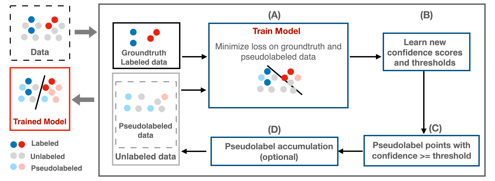

# Rethinking Confidence and Thresholds in Pseudolabeling-based SSL



**Summary:** We address overconfidence and miscalibration in pseudolabeling-based SSL with a framework for learning scores and thresholds with explicit error control. This boosts pseudolabel quality and quantity, enhancing accuracy and training efficiency in SSL.

> **Keywords:** Semi-supervised Learning, Pseudolabeling, Self-Training, Confidence Functions

# Getting Started 

## Environment Setup

1. **Create the environment**

```bash
pip install -r requirements.txt
```

2A. **Run the code**

```bash
bash run_[method]_[dataset].sh
```
where method = (fixmatch, freematch) and dataset = (cifar10, cifar100, svhn). For example, you can run
```bash
bash run_fixmatch_cifar10.sh
```

2B. **Use the script generator**

You can use the notebook `script_generator.ipynb` to generate a shell script `run.sh` and run with
```bash
bash run.sh
```

## Compute Resources
Our experiments utilized the following GPUs:
- NVIDIA GeForce RTX 4090
- NVIDIA A100 SXM4-40GB
- NVIDIA A100 SXM4-80GB
- NVIDIA L40
- NVIDIA H100 80GB HBM3
  
[CHTC GPU Lab](https://chtc.cs.wisc.edu/uw-research-computing/gpu-lab) provides GPUs other than NVIDIA GeForce RTX 4090.

## Citation
If you find this work useful, please consider citing our paper:
```bibtex
@inproceedings{
vishwakarma2024pablo,
  title={Pab{LO}: Improving Semi-Supervised Learning with Pseudolabeling Optimization},
  author={Harit Vishwakarma and Yi Chen and Satya Sai Srinath Namburi GNVV and Sui Jiet Tay and Ramya Korlakai Vinayak and Frederic Sala},
  booktitle={NeurIPS 2024 Workshop: Self-Supervised Learning - Theory and Practice},
  year={2024},
  url={https://openreview.net/forum?id=v6sg2IfGyB}
}
```
